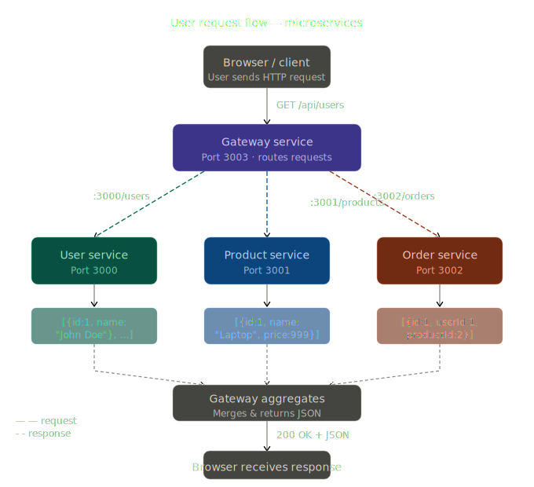
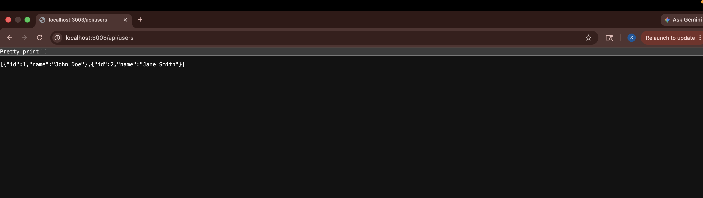
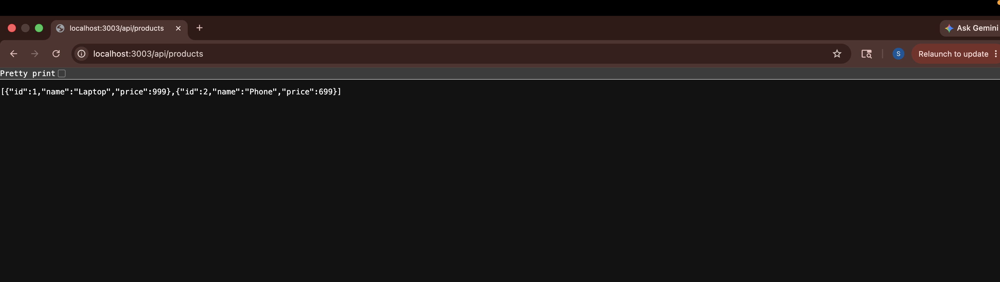
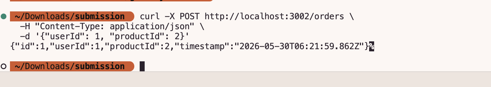
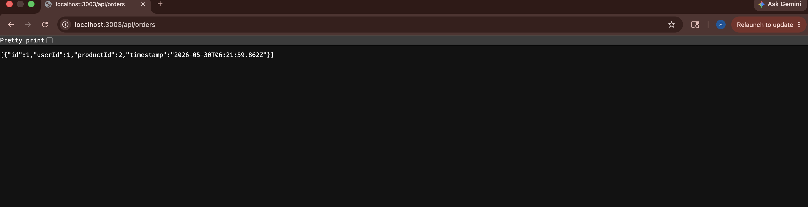
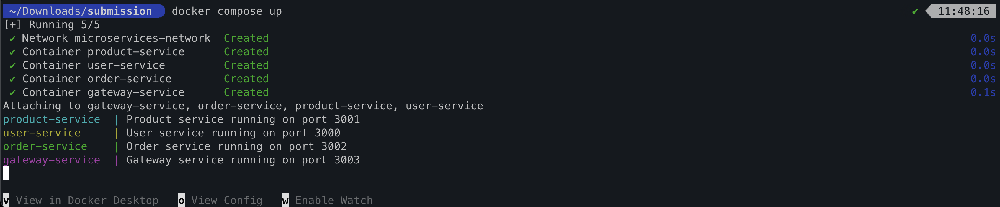
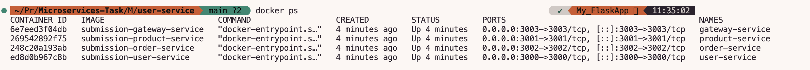

#  Microservices Containerization — Docker & Docker Compose

A Node.js microservices application fully containerized with Docker and orchestrated via Docker Compose.

<<<<<<< HEAD
=======
---

##  Architecture Overview




---
>>>>>>> 5197b2f (Update project files)


###  User Service — Port 3000
Returns a list of users. Accessible directly or via gateway.

| Detail | Value |
|--------|-------|
| Direct URL | `http://localhost:3000/users` |
| Via Gateway | `http://localhost:3003/api/users` |
| Container Port | 3000 |



---

### Product Service — Port 3001
Returns a list of products. Accessible directly or via gateway.

| Detail | Value |
|--------|-------|
| Direct URL | `http://localhost:3001/products` |
| Via Gateway | `http://localhost:3003/api/products` |
| Container Port | 3001 |



---

###  Order Service — Port 3002
Manages orders — supports GET and POST. Accessible directly or via gateway.

| Detail | Value |
|--------|-------|
| Direct URL | `http://localhost:3002/orders` |
| Via Gateway | `http://localhost:3003/api/orders` |
| Container Port | 3002 |

**POST Order:**



**GET Orders via Gateway:**



---

### Gateway Service — Port 3003
Unified API entry point — proxies all requests to the respective services.

| Detail | Value |
|--------|-------|
| Users | `http://localhost:3003/api/users` |
| Products | `http://localhost:3003/api/products` |
| Orders | `http://localhost:3003/api/orders` |
| Container Port | 3003 |

---

##  Docker Screenshots

### All Services Running — `docker compose up`


### All Containers Healthy — `docker ps`



## Setup & Running

### 1. Clone the repository
```bash
git clone https://github.com/PrajwalAnkushrao8/Skill_Test_1_Cloud-Containers.git
cd Skill_Test_1_Cloud-Containers
```

### 2. Build and start all services
```bash
docker compose up --build
```

### 3. Run in background (detached mode)
```bash
docker compose up --build -d
```

### 4. Verify all containers are running
```bash
docker compose ps
```

### 5. Stop all services
```bash
docker compose down
```

---

## 🧪 Testing Each Service

### User Service
```bash
curl http://localhost:3000/users
curl http://localhost:3003/api/users   # via gateway
```

### Product Service
```bash
curl http://localhost:3001/products
curl http://localhost:3003/api/products   # via gateway
```

### Order Service
```bash
# GET orders
curl http://localhost:3002/orders
curl http://localhost:3003/api/orders   # via gateway

# POST - create a new order
curl -X POST http://localhost:3002/orders \
  -H "Content-Type: application/json" \
  -d '{"userId": 1, "productId": 2}'


